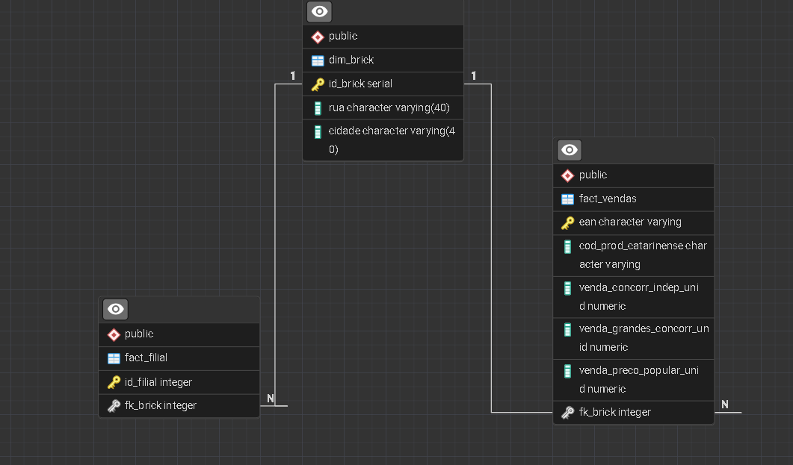

# Projeto ETL IQVIA Clamed

## Descrição

Projeto educacional desenvolvido para o DevInHouse Clamed com foco em consolidar conhecimentos de **SQL**, **modelagem de dados** e processos de **ETL** (Extração, Limpeza e Carregamento).

## Objetivos

- Aplicar conceitos de modelagem de dados e formas normais
- Implementar decisões arquiteturais em bancos de dados
- Explorar novos conhecimentos e técnicas de desenvolvimento
- Consolidar práticas de ETL

## Arquitetura

Utilizei a solução padrão **dimensional modeling** com:

- **1 Tabela de Dimensão**: Armazena atributos únicos (bricks) com IDs fixos para referência
- **2 Tabelas Fato**: Contêm métricas e relacionamentos, herdando as chaves estrangeiras da dimensão

### Fluxo ETL

1. **Extração**: Coleta de dados da fonte disponibilizadas pela clamed.
2. **Limpeza**: Tratamento e validação de dados
3. **Carregamento**: Inserção no Data Warehouse em SQL

## Tecnologias

- SQL
- Modelagem de Dados
- Python
