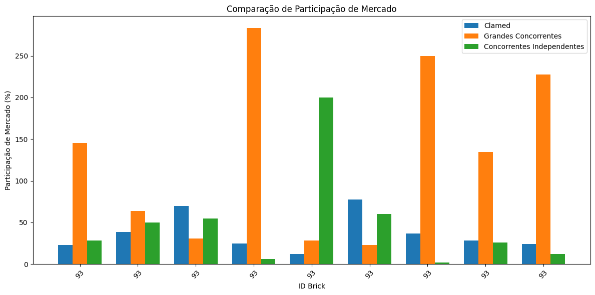

# Projeto ETL IQVIA Clamed

## Descrição

Projeto educacional desenvolvido para o DevInHouse Clamed com foco em consolidar conhecimentos de **SQL**, **modelagem de dados** e processos de **ETL** (Extração, Limpeza e Carregamento).

## Objetivos

- Aplicar conceitos de modelagem de dados e formas normais
- Implementar decisões arquiteturais em bancos de dados
- Explorar novos conhecimentos e técnicas de desenvolvimento
- Consolidar práticas de ETL

## Arquitetura

Utilizei a solução padrão **dimensional modeling** com:

- **1 Tabela de Dimensão**: Armazena atributos únicos (bricks) com IDs fixos para referência
- **2 Tabelas Fato**: Contêm métricas e relacionamentos, herdando as chaves estrangeiras da dimensão


### Fluxo ETL

1. **Extração**: Coleta de dados da fonte disponibilizadas pela clamed.
2. **Limpeza**: Tratamento e validação de dados
3. **Carregamento**: Inserção no Data Warehouse em SQL

## Tecnologias

- SQL
- Modelagem de Dados
- Python

## Como Usar

1. **Exportação dos Dados**
  - Os dados estão dispostos na pasta `data/`.

2. **Configuração do Ambiente**
  - Certifique-se de ter o Python instalado (recomenda-se versão 3.14 ou superior).

3. **Instalação das Dependências**
  - Execute o comando abaixo para instalar os pacotes necessários:
    ```bash
    pip install -r requirements.txt
    ```

4. **Execução do Processo ETL**
  - Execute o script principal para iniciar o processo ETL:
    ```bash
    python pipeline.py
    ```
  - Os dados serão extraídos, limpos e carregados no banco conforme a modelagem apresentada.


  ## Análises Realizadas

  Apesar da quantidade limitada de dados, foi possível realizar algumas análises de mercado, comparando concorrentes e preços populares (Clamed) com base nas informações fornecidas pela IQVIA. Essas análises permitiram identificar padrões de competitividade e diante disso percebi que o preço médio da Preço Popular está muito abaixo da dos seus concorrentes.

  